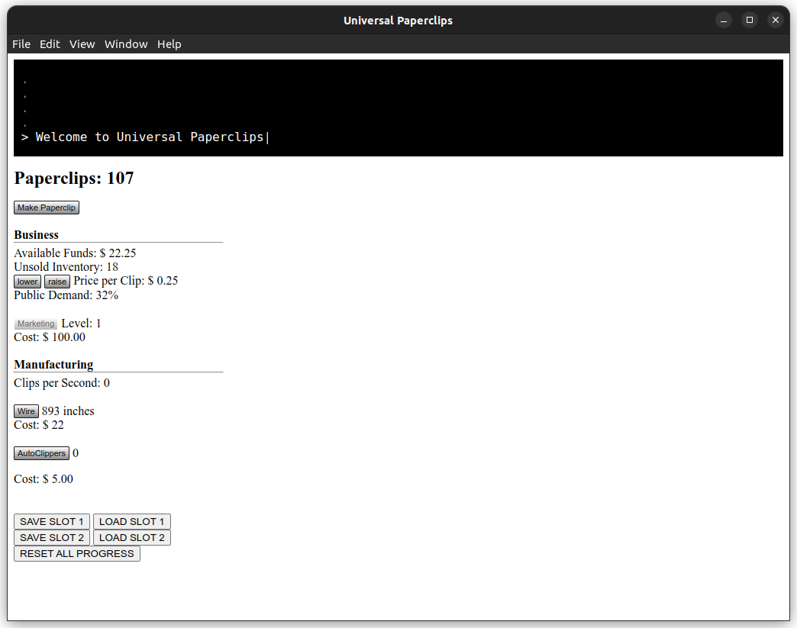

<p align="center">
  
</p>

<div align="center">
  <h1>Universal Paperclips! - Electron App</h1>
  This is an Electron port of the original <a href="https://en.wikipedia.org/wiki/Universal_Paperclips">Universal Paperclips game</a>, by New York University's <a href="https://www.franklantz.net/about-1">Frank Lantz</a>.
  <br/>
  There is also the original <a href="https://www.decisionproblem.com/paperclips/index.html">Web version</a>, as well as <a href="https://apps.apple.com/us/app/universal-paperclips/id1300634274">iOS</a> and <a href="https://play.google.com/store/apps/details?id=com.everybodyhouse.paperclipsuniquetest">Android</a> versions, made by Lantz.
  <br/>
  To support Frank, you can buy some of his nice merch <a href="https://universal-paperclips.creator-spring.com/">Here</a>.
  <br/>
  The code in the <strong>//src</strong> directory is a fork of this offline port: <a target="_blank" rel="noopener" href="https://github.com/stignarnia/UniversalPaperclipsButSaves">UniversalPaperclipsButSaves</a>
</div>

## Screenshot


_The game's main user interface_

# Installation

## Windows

There are .exe installers, and portable .zips in [Releases](https://github.com/Alex313031/univeral-paperclips-electron/releases).

## Linux

There are .deb installers, .AppImages, and portable .zips in [Releases](https://github.com/Alex313031/univeral-paperclips-electron/releases).

## MacOS

Working on it. Need a Mac to build.

# Developing/Building

Requires nodejs 14, or 16. It is reccomended to use [nvm](https://github.com/nvm-sh/nvm) for installing/managing node versions.
Yarn can also be used.

```bash
git clone https://github.com/Alex313031/univeral-paperclips-electron.git
cd univeral-paperclips-electron
nvm install # Only use if you are using nvm
npm install # Install needed npm deps
npm run start # Run app in dev mode
npm run dist # To make installation packages
```

## Documentation

See [Docs](https://github.com/Alex313031/univeral-paperclips-electron/tree/master/docs#readme)

## TODO

See [TODO.txt](TODO.txt)

## Thanks

A huge thanks to the following people for making this project possible:

- [Frank Lantz](https://www.franklantz.net/): The original creator of the game.
- [stignarnia](https://github.com/stignarnia): Creator of the offline version on which this is based.
- Oscar Beaumont's [ElectronPlayer](https://github.com/oscartbeaumont/ElectronPlayer): Of which I made a fork called [Quark-Player](https://github.com/Alex313031/quark-player), the code of which I used as a boilerplate for making this app.
